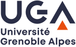

:::: {.academic-shell}
::: {.academic-sidebar}

:::

::: {.academic-main}

## About

I am a research scientist at the [Inria Centre at Université Grenoble Alpes](https://www.inria.fr/en/inria-center-universite-grenoble-alpes), in the [TRIPOP](https://team.inria.fr/tripop/) team.

::: {.institution-logos}
[{.institution-logo .inria-logo}](https://www.inria.fr/en/inria-center-universite-grenoble-alpes) 
[{.institution-logo .uga-logo}](https://www.univ-grenoble-alpes.fr/)
:::

Before that, I was a Research Associate at the University of Sydney (Australia), working with Itai Einav. I studied at the School of Mechanical Engineering of the University of Florence in Italy and completed my thesis at École Centrale de Nantes, in collaboration with Université de Versailles Saint-Quentin-en-Yvelines, Ecole des Ponts, and Ingérop. 

## Research

My work focuses on the mechanics of complex materials—materials possessing multiple inherent spatial scales. Combining theory, numerical simulations and experiments, I aim to understand their mechanical behaviour and the scale-transition process, and to derive macroscopic constitutive descriptions for large-scale systems and structures.
I develop discrete- and finite-element simulations, machine-learning methods, constitutive models and thermodynamics-based approaches. My activities concern dissipative and nonlinear phenomena such as plasticity, friction and impacts, with particular interest in fast dynamics.

Keywords: *solid mechanics, computational mechanics, scientific machine learning, constitutive modelling, multiscale materials, plasticity, impact and fast dynamics*

I have recently been awarded a chair from the Multidisciplinary Institute in Artificial Intelligence, with Vincent Acary, for the project **AIM: Artificial Intelligence and Mechanics**. You can find more details on the [AIM webpage](https://project.inria.fr/aimechanics/).

  

You can find further details in [Research](research.qmd).

## Teaching

My teaching activities include machine learning in and for mechanics, continuum mechanics, computational mechanics, and numerical analysis at doctoral, master and bachelor levels, see [Teaching](teaching.qmd).
:::
::::
