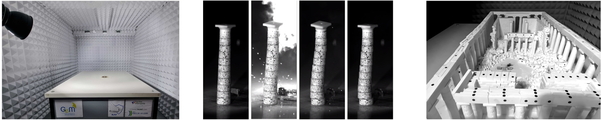

:::: {.academic-shell}
::: {.academic-sidebar}

:::

::: {.academic-main}

My research lies at the intersection of computational mechanics, constitutive
modelling and scientific machine learning. I develop physics-constrained
data-driven methods for complex materials, together with analytical, numerical
and experimental approaches for structures subjected to extreme dynamic
loading.

## Thermodynamics-constrained constitutive modelling

I develop machine-learning methods for discovering constitutive equations
directly from mechanical observations while enforcing the governing physical
constraints by construction. This work includes Thermodynamics-based
Artificial Neural Networks, autonomous discovery of internal variables, Neural
Integration for Constitutive Equations, and the learning of inelastic
constitutive models from stress–strain data under hard thermodynamic
constraints. The objective is to obtain constitutive models that remain
thermodynamically admissible, interpretable and reliable under loading paths
not represented during training.

<figure class="research-figure">
  
  <figcaption>
    Learning inelastic constitutive behaviour from stress–strain data under
    hard thermodynamic constraints.
    

    *Collaborators: F. Vincent, V. Acary, I. Einav, I. Stefanou.*
    

  </figcaption>
</figure>

## Data-driven multiscale mechanics

I study heterogeneous materials whose macroscopic response emerges from
nonlinear and irreversible mechanisms evolving at finer spatial scales. My
research combines micromechanical simulations, computational homogenisation
and thermodynamics-aware machine learning to construct efficient reduced-order
constitutive descriptions. Learned internal variables provide a compact
representation of the microscopic state, while constitutive surrogates retain
the essential effects of path dependence, dissipation and material
heterogeneity.

<figure class="research-figure">
  
  <figcaption>
    Multiscale material modelling using learned internal variables and
    thermodynamically consistent constitutive descriptions.
    

    *Collaborators: H. Leroy, E. Fabbrini, V. Acary, I. Stefanou.*
    

  </figcaption>
</figure>

## Masonry under extreme loading, reduced-scale experiments and scaling laws
Part of my research focuses on the investigation of the response and failure of masonry,
 monumental structures and free-standing artefacts subjected to explosions and other extreme dynamic
actions. These systems combine complex geometry, unilateral contact, friction,
cracking, rocking, block separation and fluid–structure interaction. My work
uses analytical models, discrete-element methods, nonlinear finite-element
simulations and coupled solid–fluid calculations to identify damage and
collapse mechanisms and support mechanically informed risk assessment.
Within the PhD thesis of A. Morsel, in collaboration with I. Stefanou and P. Kotronis, we developed
scaling approaches and reduced-scale experiments for reproducing the
response of masonry and blocky structures under blast-type loading. The work
examines how rocking, sliding, uplift, impact and collapse mechanisms can be
represented consistently at laboratory scale. Controlled shock waves,
high-speed imaging, pressure measurements and three-dimensional motion tracking
provide detailed observations for validating computational models and linking
laboratory measurements with full-scale structural behaviour.

<figure class="research-figure">
  
  <figcaption>
    Reduced-scaled experimental platform for blast testing of structures, and testing the dynamic response of
    a multi-drum column, and of a reduced-scale model of the Parthenon (Greece).
    

    *Collaborators: A. Morsel, G. Racineux,  P. Kotronis, I. Stefanou.*
    

  </figcaption>
</figure>

:::
::::